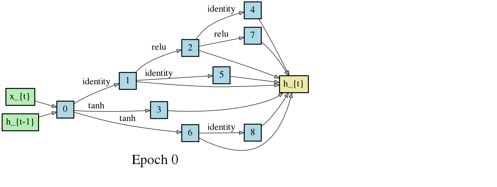

# Differentiable Architecture Search
Code accompanying the paper
> [DARTS: Differentiable Architecture Search](https://arxiv.org/abs/1806.09055)\
> Hanxiao Liu, Karen Simonyan, Yiming Yang.\
> _arXiv:1806.09055_.

<p align="center">
  
</p>
The algorithm is based on continuous relaxation and gradient descent in the architecture space. It is able to efficiently design high-performance convolutional architectures for image classification (on CIFAR-10 and ImageNet) and recurrent architectures for language modeling (on Penn Treebank and WikiText-2). Only a single GPU is required.

## Requirements
```
Python >= 3.5.5, PyTorch == 0.3.1, torchvision >= 0.2.1
```
PyTorch 0.4 will be supported soon.

## Datasets
Instructions for acquiring PTB and WT2 can be found [here](https://github.com/salesforce/awd-lstm-lm). While CIFAR-10 can be automatically downloaded by torchvision, ImageNet needs to be manually downloaded (preferably to a SSD) following the instructions [here](https://github.com/pytorch/examples/tree/master/imagenet).

## Architecture Search
To carry out architecture search, run
```
cd cnn && python train_search.py --unrolled     # for conv cells on CIFAR-10
cd rnn && python train_search.py --unrolled     # for recurrent cells on PTB
```
Snapshots of the most likely convolutional & recurrent cells over time:
<p align="center">


</p>

## Architecture Evaluation
To reproduce our results using the best cells, run
```
cd cnn && python train.py --auxiliary --cutout            # CIFAR-10
cd rnn && python train.py                                 # PTB
cd rnn && python train.py --data ../data/wikitext-2 \     # WT2
            --dropouth 0.15 --emsize 700 --nhidlast 700 --nhid 700 --wdecay 5e-7
cd cnn && python train_imagenet.py --auxiliary            # ImageNet
```
Customized architectures are supported through the `--arch` flag once specified in `genotypes.py`.

